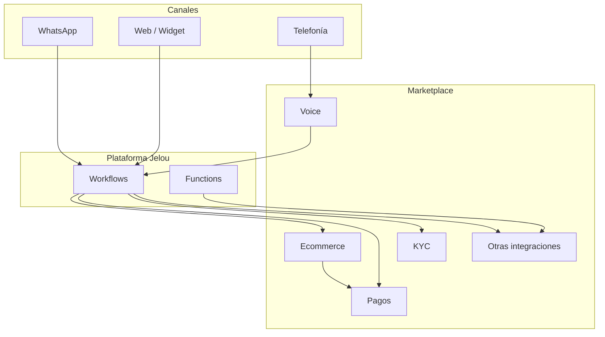

<Note>Diagrama base. Ajusta nodos y conexiones a la arquitectura real.</Note>

## Dependencias entre productos

| Desde | Hacia | Motivo |
| --- | --- | --- |
| Ecommerce | Pagos | TODO: cobro de pedidos |
| TODO | TODO | TODO |

## Ambientes

| Ambiente | URL / cluster | Notas |
| --- | --- | --- |
| Desarrollo | TODO | TODO |
| Producción | TODO | TODO |
