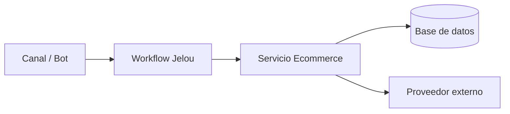

<Note>Página base. Reemplaza los bloques marcados con `TODO`.</Note>

## Qué es

TODO: qué resuelve Ecommerce, para quién y dónde vive dentro de la plataforma Jelou.

## Repositorios

| Repositorio | Qué contiene | Stack | Owner |
| --- | --- | --- | --- |
| TODO `repo-name` | TODO | TODO | TODO |

## Arquitectura

TODO: explica los componentes y el flujo principal.

## Tecnologías

- TODO

## Documentación externa

<CardGroup cols={2}>
  <Card title="TODO proveedor" icon="arrow-up-right-from-square" href="https://example.com">
    TODO: para qué sirve este enlace.
  </Card>
</CardGroup>

## Información importante

<Warning>TODO: límites, credenciales (dónde están, nunca el valor), ambientes, contactos de soporte, gotchas.</Warning>

## Pendientes

Mira los pendientes de Ecommerce en [Pendientes](/pendientes#ecommerce).
