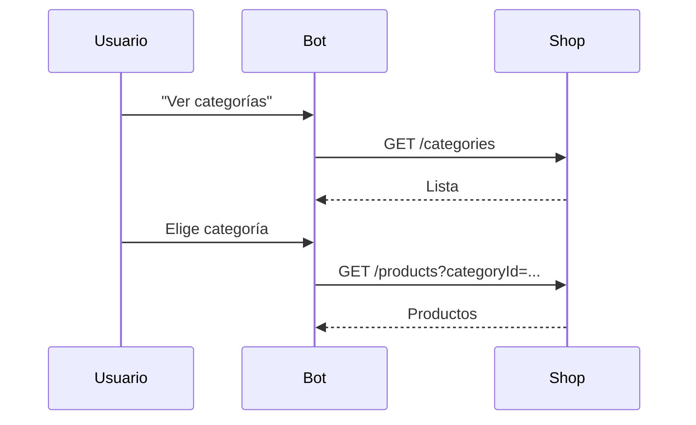

| Campo | Valor |
| --- | --- |
| Producto | Ecommerce |
| Estado | Por definir |
| Responsable | TODO |
| Repositorios | TODO |
| Tarea en ClickUp | TODO |

## Contexto

Los usuarios no pueden filtrar el catálogo por categoría desde el bot.

## Qué hace falta

- [ ] Endpoint que acepte `categoryId`
- [ ] Menú de categorías en el workflow

## Diseño

## Criterios de aceptación

- [ ] Dado un catálogo con categorías, cuando el usuario elige una, entonces solo ve productos de esa categoría.
