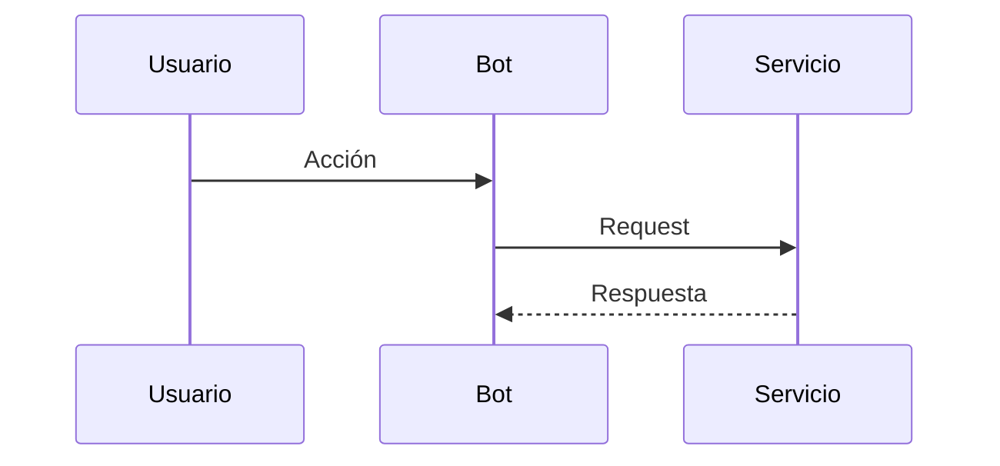

<Info>
  Copia `specs/plantilla.mdx` con un nombre nuevo, agrégalo a `docs.json` y enlázalo desde [Pendientes](/pendientes).
</Info>

| Campo | Valor |
| --- | --- |
| Producto | Ecommerce / Pagos / KYC / Voice / Otras integraciones |
| Estado | Por definir / Listo para desarrollo / En progreso / Hecho |
| Responsable | TODO |
| Repositorios | TODO |
| Tarea en ClickUp | TODO |

## Contexto

Qué problema existe hoy y por qué importa.

## Qué hace falta

- [ ] Cambio concreto 1
- [ ] Cambio concreto 2

## Diseño

Agrega capturas o mockups en `images/` y referéncialos:

```mdx
<Frame caption="Pantalla propuesta">
  
</Frame>
```

Para flujos, usa un diagrama:



## Criterios de aceptación

- [ ] Dado ..., cuando ..., entonces ...

## Fuera de alcance

- TODO
